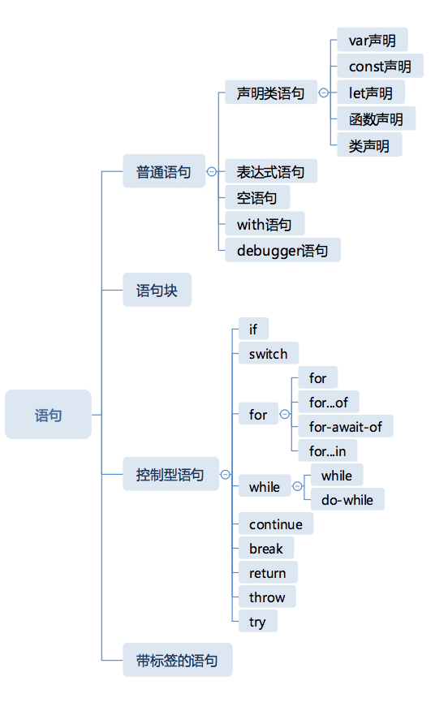

# Completion Record
```
The Completion type is a Record used to explain the runtime propagation of values and control flow such as the behaviour of statements (break, continue, return and throw) that perform nonlocal transfers of control.

完成类型是一种记录，用于解释值和控制流的运行时传播，例如执行非本地控制转移的语句（中断，继续，返回和抛出）的行为。

```
Completion Record 表示一个语句执行完之后的结果，它有三个字段：

- [[type]] 表示完成的类型，有 break continue return throw 和 normal 几种类型；
- [[value]] 表示语句的返回值，如果语句没有，则是 empty；
- [[value]] 表示语句的返回值，如果语句没有，则是 empty；

---

> JavaScript 依靠语句的 Completion Record 类型，才可以在语句的复杂嵌套结构中，实现各种控制。

### 语句分类：


```
普通语句执行后，会得到 [[type]] 为 normal 的 Completion Record，JavaScript 引擎遇到这样的 Completion Record，会继续执行下一条语句。这些语句中，只有表达式语句会产生 [[value]]

带标签的语句的作用：与完成记录类型中的 target 相配合，用于跳出多层循环。

实际上，任何 JavaScript 语句是可以加标签的，在语句前加冒号即可：

firstStatement: var i = 1;
```
